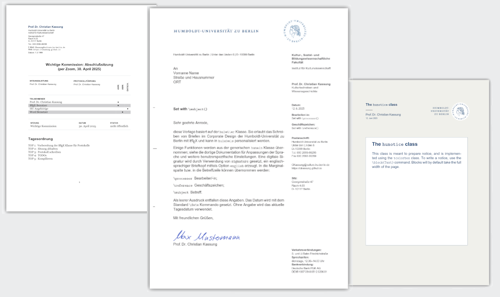

# HUtempl

**A package of LaTeX templates in line with the corporate design of [HU Berlin](https://www.hu-berlin.de).**

---

## Getting started

Why writing letters with LaTeX? 1st reason: Focussing on the content is impossible with Word and Word clones. 2nd reason: You can easily write collaboratively by using this template with Overleaf.

## Installing

For installation you either need a local LaTeX installation or use Overleaf. For the use with Overleaf, you have to download this repository as a zip file to your computer via `Code | Download ZIP` and than create a `New Project` within Overleaf by `Upload Project | Select a .zip file`. For local use, just download and unzip the project's repository.

## Customizing

For customization change all personal information in `latex/hulabels.sty`.

## Features

### Maintainers

So far, there is only one maintainer. If you are interested, please reach out!

<!-- ALL-CONTRIBUTORS-LIST:START - Do not remove or modify this section -->
<!-- prettier-ignore-start -->
<!-- markdownlint-disable -->
<table>
  <tbody>
    <tr>
      <td align="center" valign="top" width="14.28%"><a href="https://ckassung.github.io/"> <b>Christian</b></a></td>
    </tr>
  </tbody>
</table>

<!-- markdownlint-restore -->
<!-- prettier-ignore-end -->

<!-- ALL-CONTRIBUTORS-LIST:END -->
